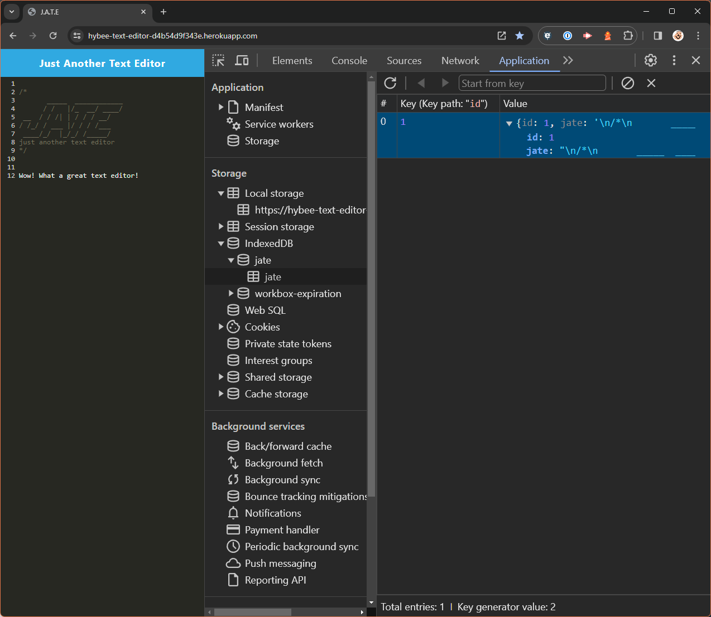
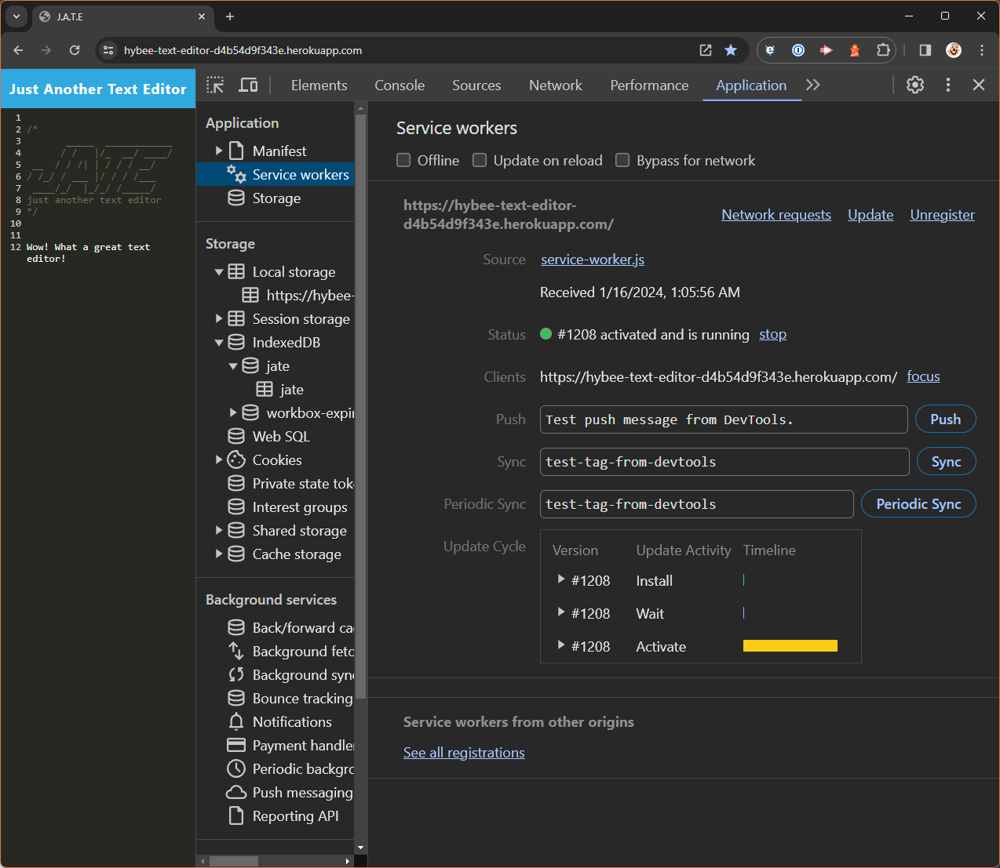
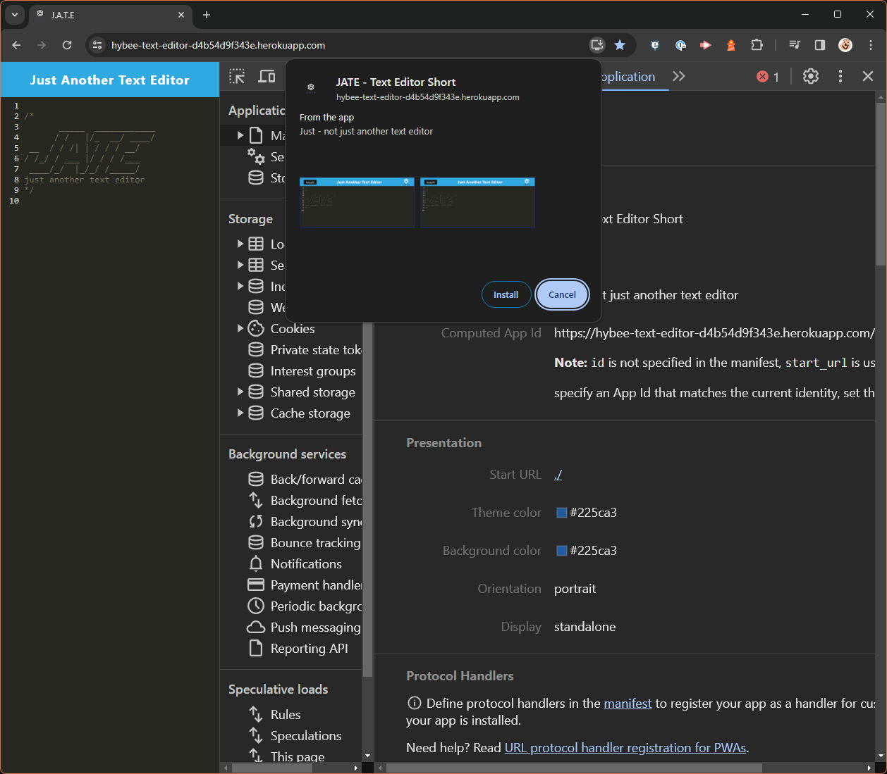

<a ID="readme-top"></a>

<div align="center">

# Just Another Text Editor (JATE)

[](https://opensource.org/licenses/MIT)
[](https://nodejs.org/en)
[](https://expressjs.com/)
[](https://webpack.js.org/)

Challenge 19 - Progressive Web Applications (PWA)
</div>

## Description

JATE is a text editor that is designed to be a single page progressive web application. Its purpose is to allow the user to write notes on a platform that can preserve the text for when they next visit connect the front-end social network application.

High level features of the application are:

* Fast and lightweight text editing tool
* Text is saved locally on the users browser so that it isn't lost on next visit
* The application will continue to function and save while offline
* The application can be installed onto devices
* The application is backwards compatible with browsers that don't support the latest version of javascript.

This application has been developed on starter code

## Table of contents


- [User Story](#user-story)
- [User Acceptance Critieria](#user-acceptance-criteria)
- [Installation](#installation)
- [Usage](#usage)
- [Screenshots](#screenshots)
- [License](#license)
- [Contributing](#contributing)
- [Testing](#testing)
- [Technologies Used](#technologies-used)
- [Questions](#questions)

## User Story <a ID="user-story"></a>

This application was developed with this user story in mind:


```md
AS A developer
I WANT to create notes or code snippets with or without an internet connection
SO THAT I can reliably retrieve them for later use
```

<p align="right">(<a href="#readme-top">back to top</a>)</p>

## User Acceptance Criteria

### This application was developed with the below User acceptance criteria:

```
GIVEN a text editor web application

WHEN I open my application in my editor
THEN I should see a client server folder structure

WHEN I run `npm run start` from the root directory
THEN I find that my application should start up the backend and serve the client

WHEN I run the text editor application from my terminal
THEN I find that my JavaScript files have been bundled using webpack

WHEN I run my webpack plugins
THEN I find that I have a generated HTML file, service worker, and a manifest file

WHEN I use next-gen JavaScript in my application
THEN I find that the text editor still functions in the browser without errors

WHEN I open the text editor
THEN I find that IndexedDB has immediately created a database storage

WHEN I enter content and subsequently click off of the DOM window
THEN I find that the content in the text editor has been saved with IndexedDB

WHEN I reopen the text editor after closing it
THEN I find that the content in the text editor has been retrieved from our IndexedDB

WHEN I click on the Install button
THEN I download my web application as an icon on my desktop

WHEN I load my web application
THEN I should have a registered service worker using workbox

WHEN I register a service worker
THEN I should have my static assets pre cached upon loading along with subsequent pages and static assets

WHEN I deploy to Heroku
THEN I should have proper build scripts for a webpack application
```

<p align="right">(<a href="#readme-top">back to top</a>)</p>

## Screenshots


Screenshot of JATE and indexDB showing text being stored
<div align="center">


</div>

Screenshot of service worker to enable offline mode
<div align="center">


</div>
  
Screenshot showing the install window of JATE
<div align="center">


</div>

<p align="right">(<a href="#readme-top">back to top</a>)</p>

## Installation

JATE is a deployed application available via this link: [JATE](https://hybee-text-editor-d4b54d9f343e.herokuapp.com/)

The below installations steps are only required if you want to run a local copy or contribute to its design (Skip to usage if you just want to make use of the application)

1. Clone or fork the repository
2. Run the below in console install necessary packages    
    
```
npm i
```
3. Once installed you can start the server with the below command in the CLI:
```
npm run start
```

<p align="right">(<a href="#readme-top">back to top</a>)</p>

## Usage

JATE is a deployed application available via this link: [JATE](https://hybee-text-editor-d4b54d9f343e.herokuapp.com/)

When launched, this application will present with the editor and display any previously saved text.

Text that you type will be saved to your browser so that when you next return you'll be able to continue from where you left off.

Some notable features:
* The application will continue to work if your internet drops out
* You have the option to install the application onto your device for easier access.

<p align="right">(<a href="#readme-top">back to top</a>)</p>
    
## License

[](https://opensource.org/licenses/MIT)

This application can be used in conjunction with licensing covered in  <b>MIT Lcensee</b>

(Click on the badge for details of the license)

<p align="right">(<a href="#readme-top">back to top</a>)</p>

## Contributing

To contribute to this application, please reach out to me via my contact details below

<p align="right">(<a href="#readme-top">back to top</a>)</p>

## Testing

Automated Test scripts have not been developed for this application

<p align="right">(<a href="#readme-top">back to top</a>)</p>

## Technologies used <a ID="technologies-used"></a>

* Javascript
* Node.js
* Node Package Manager (NPM)
* Express
* Webpack

<p align="right">(<a href="#readme-top">back to top</a>)</p>

## Questions

- Visit my GitHub page: <a href="https://github.com/hybee234"> hybee234 </a>
  
<p align="right">(<a href="#readme-top">back to top</a>)</p>

